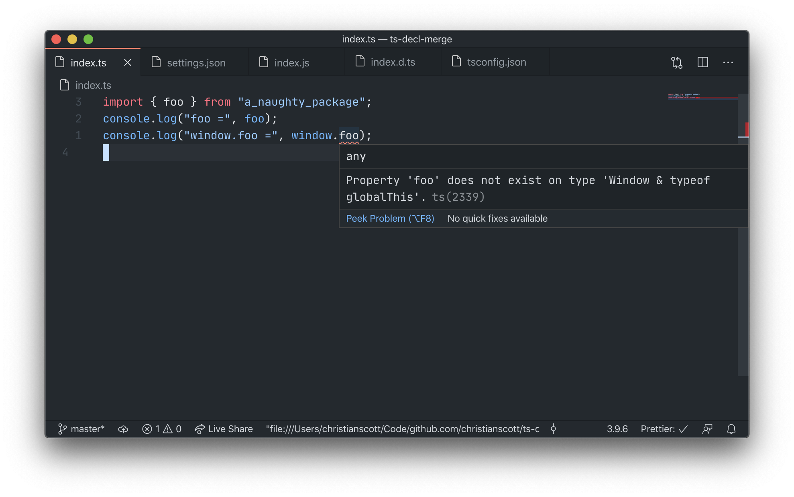

inside `node_modules/a_naughty_package/index.d.ts`:

```ts
export const foo: string
declare interface Window {
  foo: typeof foo
}
```

The error:



This means that declaration merging doesn't happen when the declaration is inside a node module.
